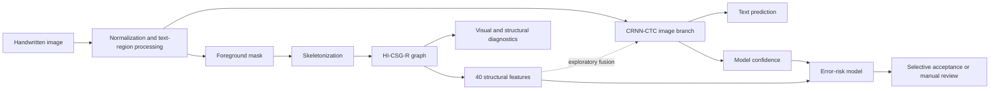

<div align="center">

# HI-CSG-R

### Handwriting-Informed Canonical Stroke Graph Representation

**A structurally controlled research pipeline for offline handwritten text recognition, visible-stroke diagnostics, and selective prediction on Russian-language handwriting.**

[](pyproject.toml)
[](LICENSE)
[](article/HI_CSG_R_v11.docx)
[](#primary-result-relevant-training-data)
[](docs/REPRODUCIBILITY.md)

[Scientific overview](#scientific-overview) ·
[Results](#what-the-study-achieved) ·
[Quick start](#quick-start) ·
[Full reproduction](#reproduction-levels) ·
[Documentation](docs/INDEX.md)

</div>

---

> [!IMPORTANT]
> **The central confirmed result is not that a graph model universally outperforms image-only HTR.** The strongest result is that a carefully selected, domain-relevant extension of the training set improves a controlled CRNN-CTC baseline across three random seeds. HI-CSG-R is primarily validated as a structural diagnostic representation; direct graph fusion remains exploratory.

## At a glance

| | |
|---|---|
| **Research problem** | Offline HTR sees only a static image, not the real pen trajectory. Recognition errors can originate from the model, the data, foreground extraction, broken strokes, page background, neighbouring text, or preprocessing. |
| **Primary recognition model** | Image-only CRNN-CTC used as a controlled and reproducible baseline. |
| **Structural representation** | HI-CSG-R: a graph of visible stroke structure built from a foreground mask and one-pixel skeleton. |
| **Primary datasets** | Cyrillic Handwriting, HKR Words, and School Notebooks. |
| **Main training protocol** | 30,000 baseline training samples; 9,998 additional relevant School Notebooks fragments in the `+10k` condition; seeds 42, 43, and 44. |
| **Main result** | Mean CER decreased from **0.152431** to **0.135479**, an absolute reduction of **0.016952** and a relative reduction of **10.89%**. |
| **Structural audit** | 200 samples manually reviewed for diagnostic suitability. |
| **Selective prediction** | Model confidence is a strong error-risk signal; adding structure increases ROC-AUC from **0.796691** to **0.812214**, although it is not better at every coverage threshold. |
| **Evidence layer** | The repository can verify the v11 claims and SHA-256 hashes of 84 frozen artifacts without datasets or a GPU. |
| **Project status** | Completed and frozen research repository, not a packaged production OCR service. |

## Scientific overview

Offline handwritten text recognition converts a scan, photograph, or cropped handwritten fragment into a character sequence. Unlike online handwriting recognition, it has no timestamped pen coordinates. The system observes only the final raster image: visible strokes, connections, background, noise, cropping, and acquisition defects.

Russian-language handwriting makes this setting especially demanding. Cyrillic characters often share similar local shapes; connected writing, digits, abbreviations, variable letterforms, notebook ruling, weak strokes, and neighbouring text create errors that cannot be explained by recognition architecture alone.

This work studies a broader question than “which model produces the lowest CER?”:

> **Can an offline HTR pipeline improve recognition while also exposing structural defects and estimating when an automatic prediction should be trusted?**

The project therefore combines four research components:

1. a controlled image-only **CRNN-CTC** baseline;
2. multi-domain data preparation and relevant training-set extension;
3. **HI-CSG-R**, a deterministic graph representation of visible stroke structure;
4. confidence- and structure-based error-risk estimation for selective prediction.

### What HI-CSG-R represents

HI-CSG-R models only information that is observable in a static image:

- foreground ink and residual background;
- one-pixel skeleton structure;
- endpoints, junction clusters, isolated components, and loop candidates;
- traced edge fragments and short or ambiguous branches;
- visible-stroke width proxies;
- normalized structural and image-quality features.

Formally, the representation is written as:

```text
G = (V, E, X_V, X_E)
```

where `V` and `E` are graph nodes and edges, and `X_V` and `X_E` contain their attributes.

> [!WARNING]
> HI-CSG-R is **not** a reconstruction of the true writing process. A static image does not uniquely reveal stroke order, writing speed, pen direction, or physical pen pressure. Stroke width is used only as an image-derived proxy.

### End-to-end research pipeline



The graph does not replace the recognizer. Its validated role is to make structural failures observable and to provide additional signals for risk analysis. Direct fusion with recognition features is retained as an exploratory experiment.

## Research questions and evidence status

| Stable claim ID | Question | Evidence level | Final status |
|---|---|---:|---|
| `H1-STRUCTURAL-DIAGNOSTICS` | Is HI-CSG-R suitable for checking foreground extraction, skeletons, and visible-stroke graphs? | Supporting | **Confirmed on the audited subset** |
| `H2-RELEVANT-DATA-AUGMENTATION` | Does a relevant extension of the training set improve CRNN-CTC? | Primary | **Confirmed across three seeds** |
| `H3-SELECTIVE-PREDICTION` | Can confidence and structure reduce CER on the accepted subset? | Supporting | **Partially confirmed** |
| `H4-GRAPH-FUSION` | Do graph features contain signal useful to the recognizer? | Exploratory | **Signal observed; stable superiority not proven** |
| `BOUNDARY-NATURAL-LINE-UNIQUENESS` | Is the improvement uniquely caused by natural line context? | Boundary | **Not confirmed** |
| `BOUNDARY-PEN-TRAJECTORY` | Does the graph recover the real pen trajectory? | Boundary | **False by problem definition** |

The machine-readable source of truth is [`research/claims.yaml`](research/claims.yaml). When historical reports disagree with later controls, the final v11 manuscript and the claim registry take priority.

## What the study achieved

### Primary result: relevant training data

The main comparison keeps the model architecture, validation set, test set, decoding procedure, and training recipe fixed. Only the training data changes:

| Condition | Training samples | Composition |
|---|---:|---|
| Baseline `tri10k_mixed` | 30,000 | 10,000 Cyrillic Handwriting + 10,000 HKR Words + 10,000 School Notebooks |
| Relevant `+10k` | 39,998 | Baseline + 9,998 accepted School Notebooks contextual fragments from training groups only |

The common validation set contains 6,000 samples. The main test set contains 5,563 samples: 1,563 Cyrillic Handwriting, 2,000 HKR Words, and 2,000 School Notebooks.

#### CER across three independent seeds

| Seed | Baseline CER | `+10k` CER | Absolute ΔCER |
|---:|---:|---:|---:|
| 42 | 0.145446 | 0.135127 | -0.010319 |
| 43 | 0.148931 | 0.137146 | -0.011785 |
| 44 | 0.162917 | 0.134165 | -0.028752 |
| **Mean** | **0.152431** | **0.135479** | **-0.016952** |

> [!TIP]
> The `+10k` condition reduced CER in **all three runs**. The mean relative CER reduction was **10.89%**.

The gain was not limited to one metric:

| Metric | Baseline | `+10k` | Change |
|---|---:|---:|---:|
| CER | 0.152431 | 0.135479 | -0.016952 |
| WER | 0.528311 | 0.488990 | -0.039321 |
| Exact-match rate | 0.424232 | 0.465037 | +0.040805 |

#### Domain-level effect

| Domain | Mean baseline CER | Mean `+10k` CER | Mean ΔCER | Relative change | Improved seeds |
|---|---:|---:|---:|---:|---:|
| Cyrillic Handwriting | 0.203650 | 0.189479 | -0.014170 | -6.75% | 3/3 |
| HKR Words | 0.101083 | 0.091986 | -0.009097 | -8.30% | 2/3 |
| School Notebooks | 0.163752 | 0.136771 | -0.026981 | -16.38% | 3/3 |

The largest and most stable improvement appears in **School Notebooks**, the domain most closely matched by the added data. The effect also transfers to Cyrillic Handwriting and improves HKR Words on average, although one HKR seed does not improve.

### What the controls changed in the interpretation

Same-size controls and strict page-disjoint experiments support a careful conclusion:

- relevant additional data improves the controlled CRNN-CTC system;
- similarly sized random crops can achieve a close result;
- page-aware, domain-matched fragments can match or outperform the line condition in a separate strict protocol;
- the full gain therefore cannot be attributed uniquely to natural line context.

The defensible scientific conclusion is broader and more useful:

> **Training-set composition, quality control, and domain relevance are major determinants of offline HTR quality.**

This boundary is important: the study confirms the value of relevant data extension, not a universal advantage of one specific crop format.

### Structural diagnostics with HI-CSG-R

The structural branch uses domain-aware binarization, skeletonization, graph construction, and diagnostic warnings.

Key implementation choices include:

- Otsu binarization for Cyrillic Handwriting and HKR Words;
- Sauvola binarization for School Notebooks, with a default window of 25 pixels;
- inversion when the foreground fraction is implausibly high;
- one-pixel skeletonization and 8-neighbour degree analysis;
- endpoint nodes, clustered junction nodes, isolated loops, and uncertain components;
- path tracing between special nodes;
- explicit short-branch and ambiguity flags instead of unconditional deletion;
- Ramer-Douglas-Peucker polyline simplification;
- visible-stroke width estimated from the Euclidean distance transform;
- a 40-dimensional global feature vector used in diagnostic and fusion experiments.

A manual audit was conducted on 200 diagnostic samples:

| Audit outcome | Value |
|---|---:|
| Foreground diagnostically usable | 1.000 |
| Skeleton diagnostically usable | 1.000 |
| Graph diagnostically usable | 1.000 |
| Overall diagnostic acceptance | 1.000 |
| Residual ruling or background traces | 44 cases |
| Lost ink fragments | 17 cases |
| Neighbouring-text noise | 3 cases |
| False ink | 1 case |

These values mean that every audited sample remained usable for structural diagnosis under the adopted review scheme. They do **not** mean that every graph was topologically perfect or defect-free. The recorded residual lines and missing ink are precisely the kinds of failures the diagnostic layer is intended to expose.

### Selective prediction and human review

Selective prediction treats HTR as a system that may abstain. Predictions with low estimated error risk are accepted automatically; the rest can be routed to manual review.

Three risk models were compared:

| Risk features | ROC-AUC | CER@90 | CER@80 | CER@70 | CER@50 |
|---|---:|---:|---:|---:|---:|
| Structure only | 0.603645 | 0.132357 | 0.133754 | 0.134980 | 0.139034 |
| CRNN-CTC confidence | 0.796691 | 0.107670 | 0.091126 | 0.077067 | **0.056861** |
| Confidence + structure | **0.812214** | **0.107610** | 0.092165 | 0.080918 | 0.063897 |

The main operational signal is model confidence. Structural features provide a modest complementary signal and increase overall ROC-AUC, but the combined model is not better at every coverage threshold. This supports a practical human-in-the-loop use case without overstating the role of the graph.

### Exploratory graph fusion

A graph-feature branch was fused with the recognizer in an additional experiment:

| Model | CER | WER | Exact-match rate |
|---|---:|---:|---:|
| Image-only `+10k` | 0.135127 | 0.492426 | **0.463599** |
| Graph fusion `+10k` | **0.133805** | **0.478634** | 0.456229 |
| Zero-graph ablation | 0.153587 | 0.536638 | 0.415244 |

The zero-graph ablation substantially degrades performance, indicating that the branch is not ignored. However, the small fusion gain was not established across multiple seeds, and exact-match accuracy is lower than for the image-only condition. The correct interpretation is therefore:

> **HI-CSG-R contains recognition-related signal, but the current fusion method is not a proven replacement for the image-only baseline.**

## Model and experimental protocol

### CRNN-CTC baseline

The controlled recognizer contains:

- four `3×3` convolutional layers with channels `1 → 64 → 128 → 256 → 256`;
- GroupNorm and ReLU;
- two `2×2` max-pooling operations, reducing sequence width by a factor of four;
- four retained vertical bins instead of complete height averaging;
- a linear projection to 256 features;
- LayerNorm, ReLU, and dropout `0.1`;
- a two-layer bidirectional LSTM with hidden size 256;
- a CTC classifier with 91 vocabulary symbols plus the blank class;
- greedy CTC decoding with a validation-selected blank penalty.

### Training settings

| Parameter | Value |
|---|---:|
| Input height | 64 px, aspect ratio preserved |
| Optimizer | AdamW |
| Learning rate | 0.0005 |
| Weight decay | 0.0001 |
| Batch size | 16 |
| Gradient clipping | 5.0 |
| Maximum epochs | 80 |
| Seeds | 42, 43, 44 |
| CTC blank-penalty schedule | -2.0 → -0.4 |

Text is NFC-normalized and lowercased, whitespace is normalized, and punctuation and digits are retained in the main CTC protocol. The test set is not used for selecting decoding parameters.

## Datasets

| Dataset | Role | Access | Expected local root |
|---|---|---|---|
| Cyrillic Handwriting | Primary Cyrillic word and short-phrase domain | Kaggle v4 | `data/raw/cyrillic-handwriting-dataset` |
| HKR Words | Primary Russian/Kazakh word-fragment domain | Manual request to the authors | `data/raw/hkr` |
| School Notebooks RU | Primary notebook domain with ruling, background, and neighbouring elements | Public Hugging Face revision | `data/raw/school_notebooks` |
| HWR200 | Diagnostic and stress-test source | Public Hugging Face revision | `data/raw/hwr200` |
| HKR Forms | Page/form diagnostics | Manual request to the authors | `data/raw/hkr` |
| IAM 3.0 | Historical English-language reference, not part of the primary Russian conclusion | Registration; non-commercial research terms | `data/raw/iam` |

Raw and processed images are intentionally not stored in Git. Dataset licenses and redistribution conditions remain controlled by their original owners. See [`docs/DATASETS.md`](docs/DATASETS.md) and [`research/datasets.yaml`](research/datasets.yaml) before downloading or redistributing any data.

## Quick start

### 1. Prerequisites

- Git
- Python **3.11** (`>=3.11,<3.12`)
- [`uv`](https://docs.astral.sh/uv/)
- No GPU or scientific dataset is required for evidence-level verification

This repository is configured as a research workspace (`tool.uv.package = false`), not as a published Python package. Run modules from the repository root.

### 2. Clone and create the environment

```bash
git clone https://github.com/galetaa/hi-csg-r.git
cd hi-csg-r

# Optional: let uv install the required Python version.
uv python install 3.11

# Install the locked CPU-safe core/development environment.
uv sync
```

For the strict committed lockfile state, use `uv sync --frozen` after cloning.

### 3. Verify the completed research package

```bash
# Show the canonical scientific claims and their final status.
uv run python -m src.pipeline status

# Check the manuscript hash, claim registries, evidence paths, and milestone tags.
uv run python -m src.pipeline verify

# Recompute frozen numerical checks and verify artifact SHA-256 hashes.
uv run python -m src.pipeline reproduce-lite

# Rebuild derived CSV tables from machine-readable evidence.
uv run python -m src.pipeline regenerate-tables

# Run the repository test suite.
uv run pytest
```

A healthy evidence-level run should end without `FAIL`. Documented `WARN` entries may remain for known evidence gaps; they are deliberately surfaced rather than hidden.

Generated tables are written to:

```text
reproducibility/generated/
```

### 4. Inspect the command-line interface

```bash
uv run python -m src.pipeline --help
```

| Command | Purpose |
|---|---|
| `status` | Print canonical claim statuses. |
| `verify` | Validate the manuscript, claims, evidence paths, and frozen milestones. |
| `reproduce-lite` | Verify key numbers and the artifact checksum inventory. |
| `audit-data` | Report which expected dataset roots are locally available. |
| `reproduce-full` | Check readiness for complete training/evaluation reproduction. |
| `regenerate-tables` | Recreate key result tables from JSON evidence. |
| `validate-manifest` | Validate a JSONL dataset manifest; optionally check image paths. |
| `snapshot` | Write a provenance snapshot for the current environment. |
| `build-inventory` | Rebuild the artifact inventory after an intentional new research freeze. |

> [!CAUTION]
> Do not run `build-inventory` merely to silence an unexpected checksum mismatch. First determine why an immutable artifact changed and record a new scientific snapshot intentionally.

## Installation profiles

The default PyTorch configuration is CPU-safe. Install only the groups required for the task.

| Use case | Command |
|---|---|
| Evidence verification and core CV/graph utilities | `uv sync` |
| Neural HTR and transformer baselines | `uv sync --group ml` |
| PyTorch Geometric experiments | `uv sync --group ml --group gnn-pyg` |
| DGL experiments | `uv sync --group ml --group gnn-dgl` |
| Experiment tracking and LightGBM | `uv sync --group experiments` |
| Documentation | `uv sync --group docs` |
| Annotation tools | `uv sync --group annotation` |
| Dataset download helper | `uv sync --group data-download` |

PyG and DGL are alternative graph stacks; installing both is normally unnecessary.

<details>
<summary><strong>CUDA environments</strong></summary>

The committed `pyproject.toml` points `torch` and `torchvision` to the CPU wheel index. For a new CUDA run, change the explicit PyTorch index to the wheel source matching the target CUDA version, refresh the lockfile in a new branch, and preserve the resulting environment snapshot with the run artifacts.

Do not modify the frozen environment merely to verify the published evidence; CUDA is unnecessary for `verify`, `reproduce-lite`, or table regeneration.

</details>

## Restoring datasets

Start with a dry-run plan:

```bash
uv sync --group data-download
uv run python -m scripts.download_datasets plan
```

Public downloads require an explicit execution flag:

```bash
# Approximately 45.5 GB; revision pinned in research/datasets.yaml.
uv run python -m scripts.download_datasets download hwr200 --execute

# Approximately 3.1 GB.
uv run python -m scripts.download_datasets download school_notebooks --execute

# Kaggle dataset version 4; Kaggle authentication may be required.
uv run python -m scripts.download_datasets download cyrillic_handwriting --execute
```

Extract supported archives into the expected interim layout:

```bash
uv run python -m scripts.download_datasets extract \
  hwr200 school_notebooks --execute

uv run python -m scripts.download_datasets extract iam --execute
```

Check manually obtained IAM and HKR archives:

```bash
uv run python -m scripts.download_datasets manual-check \
  iam hkr_words hkr_forms
```

Record local checksums after acquisition:

```bash
uv run python -m scripts.download_datasets checksum \
  cyrillic_handwriting school_notebooks hwr200 iam hkr_words
```

Local acquisition provenance is written under `data/local_provenance/`, which is excluded from Git.

> [!NOTE]
> HKR data cannot be redistributed by this repository and requires the authors' access procedure. IAM also has registration and usage restrictions. The downloader intentionally does not mirror restricted archives.

## Reproduction levels

“Reproducibility” is divided into three distinct levels so that available evidence is not confused with unavailable raw data or weights.

### Level 1 — evidence reproduction

**Available now without datasets, checkpoints, or GPU.**

```bash
uv sync
uv run python -m src.pipeline verify
uv run python -m src.pipeline reproduce-lite
uv run python -m src.pipeline regenerate-tables
uv run pytest
```

This level checks, among other things:

- the v11 manuscript SHA-256;
- mean baseline and `+10k` CER across the three seeds;
- structural-audit sample count and acceptance values;
- selective-prediction ROC-AUC values;
- page-disjoint manifests, predictions, summaries, configurations, and histories;
- the SHA-256 inventory of 84 canonical artifacts.

### Level 2 — evaluation reproduction

Re-evaluating frozen checkpoints requires both the original images and model-weight files. These are not stored in the public repository, so this level is currently unavailable from a clean clone.

### Level 3 — training reproduction

The training recipe, seeds, configurations, historical environment snapshots, and experiment artifacts are preserved. The three final-training datasets must first be restored under their expected local roots.

Check local readiness:

```bash
uv run python -m src.pipeline audit-data
uv run python -m src.pipeline reproduce-full
```

On a clean clone, `reproduce-full` is expected to print `BLOCKED` and return code `2`. This is a readiness result, not a failure of evidence verification.

### Recreating the historical experiment layout

The one-off training and experiment runners are preserved in `archive/legacy_tools/`. Their original file layout is available through frozen milestone tags. For the latest publication-stage layout:

```bash
git worktree add ../hi-csg-r-publication-v3 \
  milestone/publication-v3-final

cd ../hi-csg-r-publication-v3
uv sync
```

Treat milestone tags as immutable. Run new experiments in a separate branch or worktree and preserve configuration, environment, history, predictions, summaries, and provenance alongside the new results.

## Manifest and provenance utilities

Validate a JSONL manifest:

```bash
uv run python -m src.pipeline validate-manifest \
  path/to/manifest.jsonl
```

Also verify referenced image paths:

```bash
uv run python -m src.pipeline validate-manifest \
  path/to/manifest.jsonl --check-images
```

Write a provenance snapshot:

```bash
uv run python -m src.pipeline snapshot \
  --out provenance.json
```

The snapshot is useful for new experiments and restored datasets. It should record dataset revisions, checksums, split identities, environment information, and the repository state used for the run.

## Repository structure

```text
article/                  Final and historical manuscripts
configs/                  Experiment configurations
research/                 Claims, evidence, datasets, pipeline, and milestones
reproducibility/          Synthetic smoke fixture and generated evidence tables
src/datasets/             Metadata, converters, normalization, and split utilities
src/preprocessing/        Image preprocessing and School foreground extraction
src/graph/                Binarization, skeletonization, and HI-CSG-R construction
src/htr/                  CRNN-CTC, decoding, metrics, uncertainty, and fusion adapters
src/pipeline/             Canonical research verifier and provenance utilities
src/visualization/        Visualization utilities
scripts/                  Canonical operational automation, including data acquisition
notebooks/                Interactive analysis material
outputs/                  Frozen result and evidence packages
data/                     Manifests, diagnostic gold subsets, and dataset reports
tests/                    Scientific-invariant and implementation tests
docs/                     Current documentation and historical reports
archive/legacy_tools/     Archived one-off experiment runners and report generators
```

The project deliberately separates three layers:

1. **Scientific core** — reusable code under `src/`;
2. **Declarative research state** — machine-readable claims and evidence under `research/`;
3. **Historical implementation** — immutable outputs and archived experiment tools.

The canonical `src/pipeline` interface verifies the final research state. It does not silently launch expensive training jobs or rewrite historical evidence.

## Canonical research state

| Item | Canonical source |
|---|---|
| Final manuscript | [`article/HI_CSG_R_v11.docx`](article/HI_CSG_R_v11.docx) |
| Manuscript SHA-256 | `86bdd1d5a2aca811824d30b466095b4a5c502522049eca0002cc4dca9c92bb79` |
| Scientific claims | [`research/claims.yaml`](research/claims.yaml) |
| Machine-checkable values | [`research/evidence.yaml`](research/evidence.yaml) |
| Dataset registry | [`research/datasets.yaml`](research/datasets.yaml) |
| Pipeline registry | [`research/pipeline.yaml`](research/pipeline.yaml) |
| Frozen milestones | [`research/milestones.yaml`](research/milestones.yaml) |
| Artifact checksums | [`research/artifact_inventory.json`](research/artifact_inventory.json) |
| Documentation index | [`docs/INDEX.md`](docs/INDEX.md) |

In the final v11 manuscript, HI-CSG-R expands to **Handwriting-Informed Canonical Stroke Graph Representation**. Some earlier package metadata retains the wording “Handwriting-Informed Robust Canonical Stroke Graphs”; the v11 manuscript is treated as canonical for scientific interpretation.

## Frozen milestones

| Tag | Commit | Research stage |
|---|---|---|
| `milestone/problem-definition-v1` | `d5ad781` | Problem definition and initial hypotheses |
| `milestone/data-graph-pilot-v1` | `44af7c3` | Dataset audit and graph pilot |
| `milestone/htr-baselines-v1` | `e73b7f1` | Stable CRNN-CTC baselines |
| `milestone/first-evidence-freeze-v1` | `3fc7974` | First evidence freeze |
| `milestone/final-evidence-v1` | `35fcb36` | Final experimental evidence package v1 |
| `milestone/publication-v3-final` | `d9f8bde` | Same-size and page-disjoint controls; final chronology |

The project history is append-only: published milestones and frozen outputs are not rewritten to match later interpretations. Scientific refinements are added as new claims, evidence, and milestones.

## Limitations

- The 200-sample structural audit is diagnostic, not a complete pixel-level graph-topology gold standard.
- No independent second annotator or inter-annotator agreement measurement is available.
- True pen order, speed, direction, and physical pressure cannot be recovered from the offline image.
- A full fine-tuned comparison with strong modern transformer HTR models under the same protocol was not completed.
- Writer metadata is unavailable for some datasets, so a global writer-disjoint conclusion is not possible.
- Strict page-disjoint controls cover the HKR+School setting, not every experiment in the repository.
- The mechanism of the data gain cannot be attributed exclusively to natural line context.
- Graph fusion is supported only as an exploratory result and requires multi-seed replication.
- Public data and model checkpoints are not fully bundled with the repository, so evidence reproduction is currently stronger than end-to-end rerunning from a clean clone.

## Documentation

- [`docs/INDEX.md`](docs/INDEX.md) — documentation map
- [`docs/ARCHITECTURE.md`](docs/ARCHITECTURE.md) — canonical architecture and project layers
- [`docs/CLAIMS.md`](docs/CLAIMS.md) — human-readable scientific claim matrix
- [`docs/EVIDENCE.md`](docs/EVIDENCE.md) — machine-verifiable evidence chain
- [`docs/REPRODUCIBILITY.md`](docs/REPRODUCIBILITY.md) — evidence, evaluation, and training reproduction
- [`docs/DATASETS.md`](docs/DATASETS.md) — dataset acquisition, restrictions, and checksums
- [`article/HI_CSG_R_v11.docx`](article/HI_CSG_R_v11.docx) — final manuscript

## Citation

Please cite the final v11 manuscript and this repository when using the method, code, or frozen evidence. The public package metadata still contains a placeholder author field, so the final author name should be inserted before publishing a formal BibTeX record.

```bibtex
@misc{hi_csg_r_2026,
  title        = {HI-CSG-R: Handwriting-Informed Canonical Stroke Graph Representation for Offline Handwritten Text Recognition},
  author       = {REPLACE WITH FINAL AUTHOR NAME},
  year         = {2026},
  howpublished = {GitHub repository and final v11 manuscript},
  url          = {https://github.com/galetaa/hi-csg-r}
}
```

## License

The source code is licensed under the [Apache License 2.0](LICENSE).

Dataset licenses, access rules, and redistribution restrictions are defined by the original dataset owners and must be reviewed separately. The repository license does not override dataset terms.